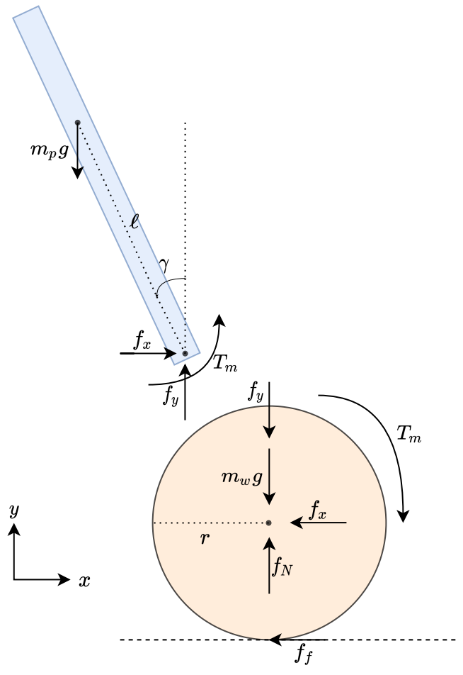
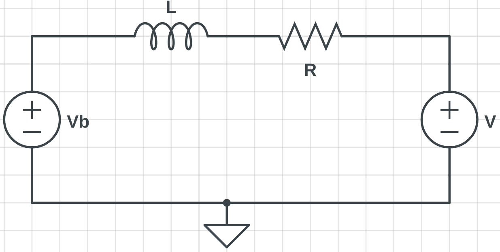

## Two-wheeled Inverted Pendulum Dynamics

The TWIP is by construction an inverted pendulum that is no longer fixed at a single point. While fairly easy to design an implement, analysis of this system leads to a set of coupled non-linear equations. Notably, the principles behind the TWIP are present in a large number of other systems (Rockets, Bipedal, Segways). As a result, designing an efficient controller for this system has been an active area of research. However, the TWIP belongs to a set of underactuated robots, which implies that it is inherently unstable (without an active controller) and coupled with the non-intuitive nature of the dynamics, it is a challenge to design a robust controller. 

The analysis of the TWIP can begin with a simple free body diagram.

The system can be analyzed in 2D to simplify the problem slightly. Analyze each component (body & wheel) separately.
Equations for each Wheel

$$
\begin{align}
    \ddot{x}m_{w} &= f_{f} - f_{x}\\
    \ddot{y}m_{w} &= f_N - f_y - m_{w}g = 0\\
    I_{w}\ddot{\psi} &=  -f_{f}r  + T_{m}
\end{align}
$$

Equations for pole
$$
\begin{align}
    \ddot{x}_{p}m_{p} &= 2f_{x}\\
    \ddot{y}_{p}m_{p} &= 2f_y - m_{p}g = 0\\
    I_{p}\ddot{\gamma} &=  2 f_{y}\ell \sin(\gamma) -2 f_{x}\ell \cos(\gamma) + 2T_{m}
\end{align}
$$

The relationship between wheel rotation ($\psi$) and wheel linear displacement ($x$) is
$$
\begin{align}
    x &=\psi r\\
    \dot{x} &=\dot{\psi}r\\
    \ddot{x} &=\ddot{\psi}r
\end{align}
$$

The center of gravity is displaced as governed by
$$
\begin{align}
    x_{p} &= x - \ell\sin(\gamma)\\
    y_{p} &= \ell\cos(\gamma)
\end{align}
$$

Taking time derivatives,
$$
\begin{align}
    \dot{x}_{p} &= \dot{x} - \dot{\gamma}\ell\cos(\gamma)\\
    \ddot{x}_{p} &=\ddot{x} -\ell\ddot{\gamma}\cos(\gamma)+\ell\dot{\gamma}^2\sin(\gamma)\\
    \dot{y}_{p} &= -\dot{\gamma}\ell\sin(\gamma)\\
    \ddot{y}_{p} &= -\ell\ddot{\gamma}\sin(\gamma)-\ell\dot{\gamma}^2\cos(\gamma
\end{align}
$$

Simplifying a little ...
$$
\begin{align}
    I_{p}\ddot{\gamma} &=  m_p g\ell \sin(\gamma) - \ddot{x}_{p}m_{p}\ell \cos(\gamma) +2T_{m}\\
    &= m_p g\ell \sin(\gamma) - (\ddot{x}-\ell\ddot{\gamma}\cos(\gamma)+\ell\dot{\gamma}^2\sin(\gamma))m_{p}\ell \cos(\gamma) +2T_{m}\\
    I_{p}\ddot{\gamma}  &=2 T_m + m_p g\ell \sin(\gamma) - \ddot{x} m_{p}\ell \cos(\gamma)\\
    &+m_{p}\ell^2\ddot{\gamma}\cos^2(\gamma) -m_{p}\ell^2\dot{\gamma}^2\sin(\gamma)\cos(\gamma)
\end{align}
$$

Simplifying further ...
$$
\begin{align}
     I_{w}\ddot{\psi} &= -(\ddot{x}m_{w} + f_{x}) r + T_{m}\\
     I_{w}\ddot{\psi} &= -(\ddot{x}m_{w} + \dfrac{\ddot{x}_{p}m_{p}}{2}) r + T_{m}\\
     I_{w}\dfrac{\ddot{x}}{r} &= -\ddot{x}m_{w}r -\ddot{x}_{p}\dfrac{m_{p}r}{2} + T_{m}\\
     I_{w}\dfrac{\ddot{x}}{r} &= -\ddot{x}m_{w}r -(\ddot{x}-\ell\ddot{\gamma}\cos(\gamma)+\ell\dot{\gamma}^2\sin(\gamma))\dfrac{m_{p}r}{2} + T_{m}\\
     I_w\ddot{x} &=T_m r - \ddot{x}m_{w}r^2 - \ddot{x} \dfrac{m_{p}r^2}{2} - \ell\dot{\gamma}^2\sin(\gamma)\dfrac{m_{p}r^2}{2} +\ell\ddot{\gamma}\cos(\gamma) \dfrac{m_{p}r^2}{2}\\
     I_w\ddot{x} &=T_m r - (m_{w} + \dfrac{m_{p}}{2})\ddot{x}r^2 - \left[\dot{\gamma}^2\sin(\gamma) - \ddot{\gamma}\cos(\gamma)\right]\dfrac{m_{p}\ell r^2}{2}
\end{align}
$$

To understand how the torque $T_m$ is generated, consider the circuit below

As the motor rotates, a potential ($V_b$) is induced which is equal to $V_b = K_e \dot{\psi}$, where $K_e$ is the emf constant. The motor torque is equal to $T = K_t i$, where $K_t$ is the motor torque constant. Solving for the steady state torque,

$$
\begin{align}
    i &= \dfrac{V - V_b}{R} = \dfrac{V - K_e \dot{\psi}}{R}\\
    T &= K_t\dfrac{V - K_e \dot{\psi}}{R}
\end{align}
$$

To obtain the torque $T_m$, damping be considered. The final torque generated is
$$ T_m =\dfrac{K_t}{R}(V - K_e \dot{\psi}) - b \dot{\psi}$$
Note, it is assumed the moment of inertia of the motor shaft is negligible when compared to the wheel.

Finally, the analysis above results in the following two equations

$$
\begin{align}
 \ddot{x} &= \dfrac{\left[\dfrac{K_t}{R}(V - K_e \dot{\psi}) - b \dot{\psi} \right] r - \left[\dot{\gamma}^2\sin(\gamma) - \ddot{\gamma}\cos(\gamma)\right]\dfrac{m_{p}\ell r^2}{2}}{\left[I_w + (m_{w} + \dfrac{m_{p}}{2}) r^2\right]}\\
 \ddot{\gamma} &= \dfrac{2 \left[ \dfrac{K_t}{R}(V - K_e \dot{\psi}) - b \dot{\psi} \right] + m_p g\ell \sin(\gamma) - \ddot{x} m_{p}\ell \cos(\gamma)+m_{p}\ell^2\ddot{\gamma}\cos^2(\gamma) -m_{p}\ell^2\dot{\gamma}^2\sin(\gamma)\cos(\gamma)}{I_p}
\end{align}
$$