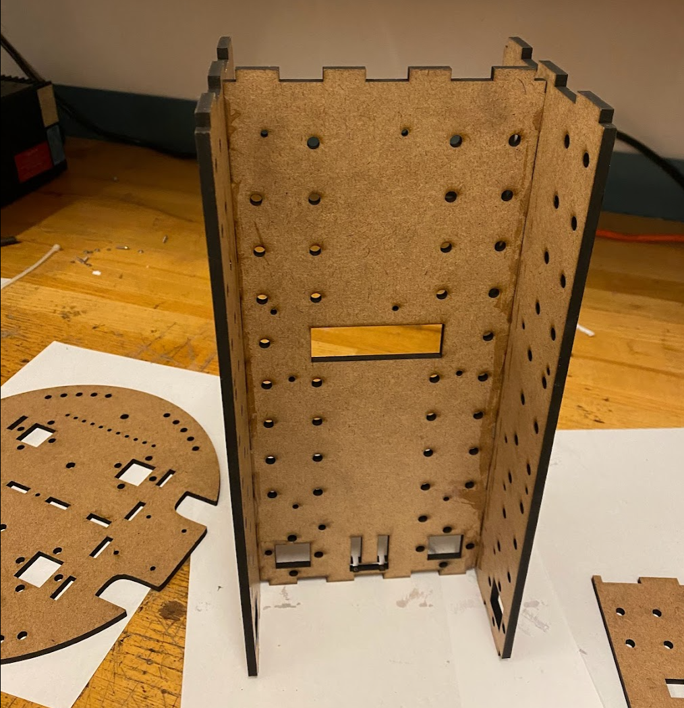
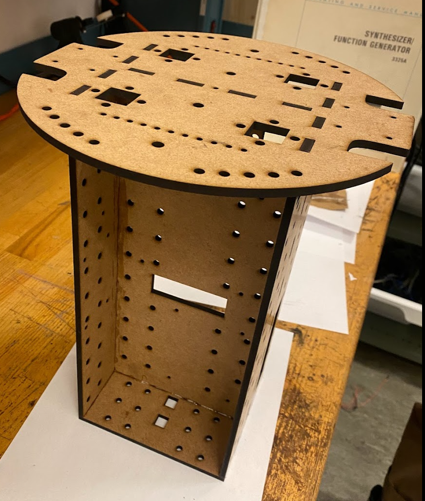
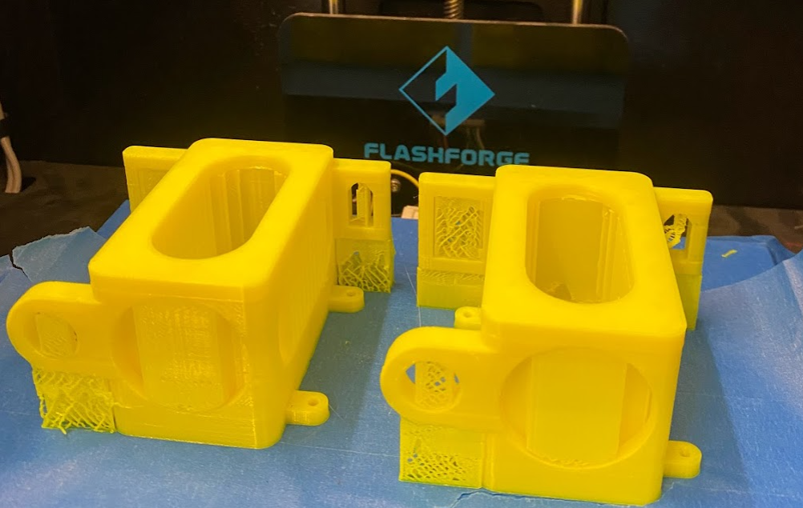
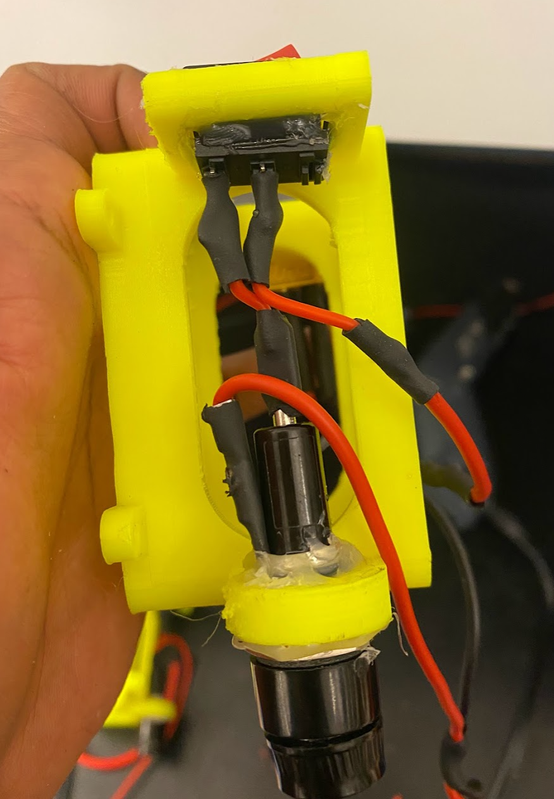
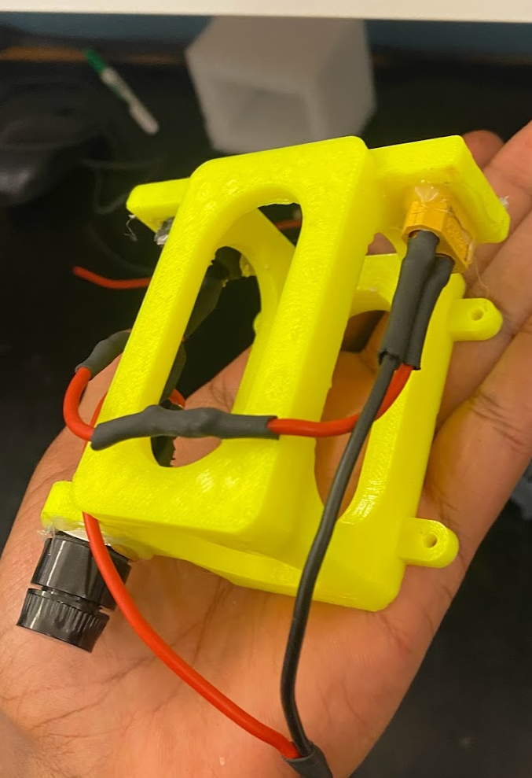
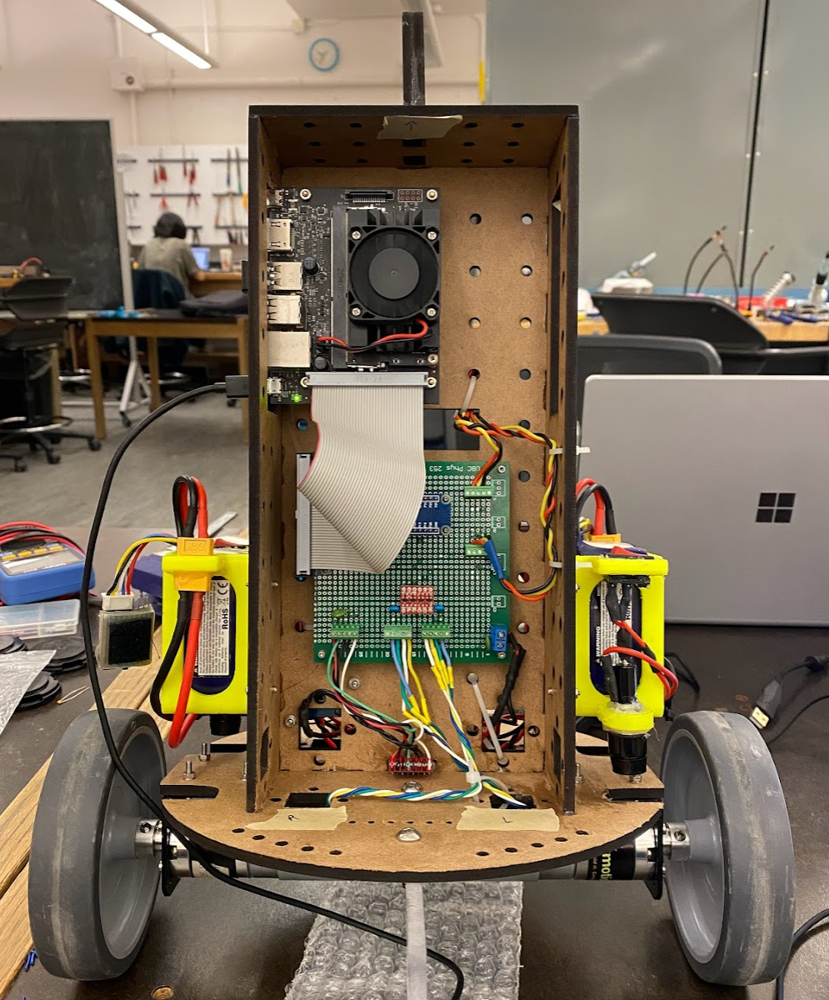

# Robot Setup

This document outlines the steps to construct the two-wheeled inverted pendulum robot. Before starting the construction you will several things. First, consult the [BOM](setup.md) for the parts required for the robot. Second, open up the [CAD](https://cad.onshape.com/documents/430d4af740243dc0e842d2a6/w/42cfe57eb2477e6d1bc0bfd3/e/dd30410687349c102bbbacfb) and obtain DXF files of the robot frame (base plate, main wall, side walls, etc). At this point you can also obtain the STL file for the battery holder which you can 3D print.

## Robot Frame
To construct the frame you will need access to a laser cutter. Import the DXF files obtained from the CAD into your favourite laser cutting software and cut the pieces using 5mm hardboard. The support legs do not have to be cut from hardboard, we found that they tended to break often, rather they can be waterjet cut or cut with a stronger material.

Example of the laser cutter software.

Cutting the hardboard.

Once the material has been cut, epoxy together the frame. The order that the board should be put together is as follows
- The left, right and center wall
- The top and bottom plates
- The handle (optional)

The frame should look similar to the image above.

## Assembly
Once the frame has been assembled, you are ready to put all the electronics together. To get started, gather some tools.

### Terminal Block
The first item to mount will be the terminal block. Cut the jumpers into groups of three and insert them into the block. Using some M3 bolts, mount the block to the side opposite where the jetson will eventually sit.

### Motor Driver
Mount the motor drivers on the same side as the terminal blocks. Ensure you have a pair of wires which you will connect to the terminal block later.

### Central Electronics Board
On the opposite side of the middle wall, you will mount the main PCB that wire mounts are connected to. The regulator should be placed on the same side as the terminal block.

### Battery Holders
3D print the battery holders with supports using your favourite 3D printer. Insert the fuse holder, battery connecter and switch into their slots and solder some connections as shown.

### Motor & Mount
Mount the motor onto the L-bracket mount using some M3 bolts. Insert the wheel onto the motor shaft and secure it using a M3 set screw.

### Jetson & Rest
Finally, mount the Jetson on the same side as the central PCB. Place the Jetson near the side to ensure access. At this point you can optionally add the support legs (first remove the terminal block to get access) using M5 bolts.

### Wiring
The terminal block is used as a central location where the motor drivers, regulator, batteries can connect to. The connections in the block should have the following groups

1. Regulator Power in, Battery (A) Power
2. Regulator Ground, Battery (A) Ground, MPU6050 unused pins
3. Left Motor Driver Power, Right Motor Driver Power, Battery (B) Power
3. Left Motor Driver Ground, Right Motor Driver Ground, Battery (B) Ground]

The rest of the wires should be held down by zip ties to ensure they are secure.
